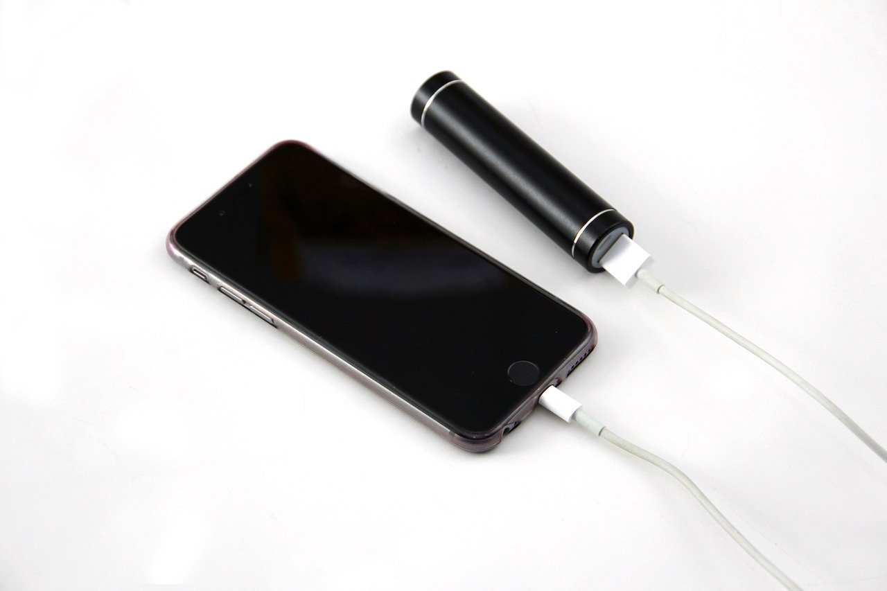
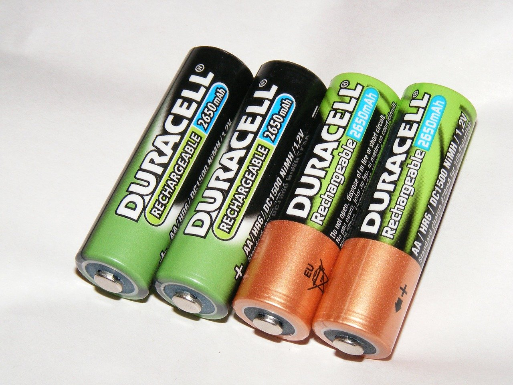

## Lithium-Ionen Akkus

Lithium-Ionen Akkus sind die meist verbreitesten Akkus. Sie haben eine hohe Energiedichte und eine hohe Lebensdauer. Außerdem halten sie größere Temperaturunterschiede aus und sind kostengünstig herzustellen. Hier gibt es mehr Informationen.  

## Lithium-Polymere Akkus

Lithium-Polymere Akkus sind eine Weiterentwicklung von Lithium Ionen Akkus. Sie können in unterschiedlichen Formen hegestellt werden und haben eine größere Energiedichte. Dafür sind sie empfindlicher als die Lithium Ionen Akkus. Hier gibt es mehr Informationen.  

## Nickel-Metallhydrid Akkus

NiMH Akkus kenn man vor allem als Batterie Ersatz, aber sie stecken in viel mehr Geräten. Sie zeichnen sich durch hohe Sicherheit und Zuverlässigkeit aus. Allerdings haben sie eine geringere Energiedichte.